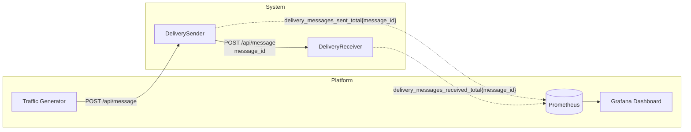

# Гарантии доставки сообщений

## Модель системы



### Сервис DeliverySender

**POST /api/message** — отправка сообщения
1. Генерирует `messageId` (GUID)
2. Регистрирует метрику `delivery_messages_sent_total{message_id}`
3. Отправляет HTTP POST на `http://delivery-receiver/api/message`
   - Body: `{ "messageId": "..." }`
   - Timeout: 1s

### Сервис DeliveryReceiver

**POST /api/message** — приём сообщения
- Принимает `{ "messageId": "..." }`
- Регистрирует метрику `delivery_messages_received_total{message_id}`

### Метрики (Dashboard: Delivery Guarantees)
- Messages Sent (unique) — отправленные сообщения
- Messages Received (unique) — полученные сообщения
- Message Loss (unique IDs not received) — потерянные сообщения
- Duplicates (IDs received > 1 time) - повторно обработанные сообщения

## Сценарий 1 - at-most-once

1. Запустить платформу с сервисами DeliverySender и DeliveryReceiver
2. Запустить генерацию трафика на DeliverySender
```
curl -X 'POST' \
  'http://localhost:5050/api/traffic/start' \
  -H 'accept: text/plain' \
  -H 'Content-Type: application/json' \
  -d '{
  "targetUrl": "http://delivery-sender/api/message",
  "rps": 3,
  "durationSeconds": 300
}'
```
3. Наблюдать метрики
    - Messages Sent (unique) = Messages Received (unique)
    - Количество отправленных сообщений совпадает с количеством принятых сообщений
4. Запустить замедление сети
```
curl -X 'POST' \
  'http://localhost:5050/api/failures/network/delay' \
  -H 'accept: text/plain' \
  -H 'Content-Type: application/json' \
  -d '{
  "containerName": "delivery-receiver",
  "delayMs": 1000,
  "durationSeconds": 30,
  "jitterMs": 100
}'
```
5. Наблюдать метрики
    - Messages Sent (unique) > Messages Received (unique)
    - Появились потерянные пакеты