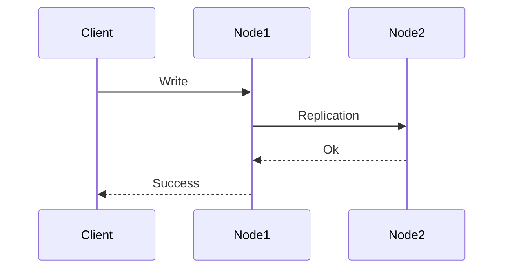
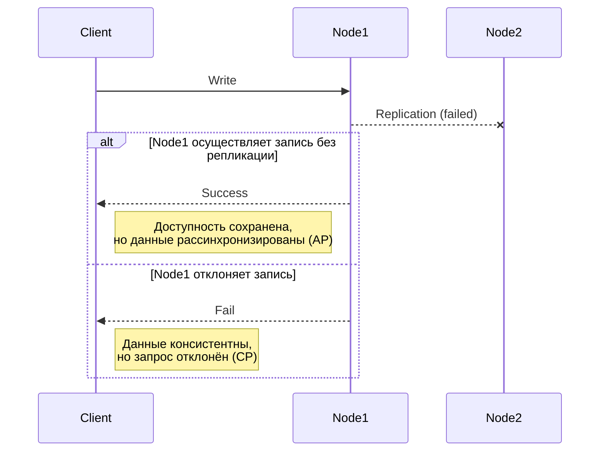

# Взаимодействие узлов в распределённых системах

Распределённые системы состоят из множества узлов (компьютеров или процессов), которые обмениваются сообщениями по сети и совместно выполняют задачи. Для пользователя такая система выглядит как единое целое, но внутри неё узлы должны постоянно взаимодействовать между собой. Это взаимодействие может происходить двумя принципиально разными способами: синхронно или асинхронно. Мы рассмотрим, что означает каждый из этих подходов, какие существуют гарантии доставки сообщений, а также разберём фундаментальную CAP-теорему, описывающую ограничения распределённых систем.

### Взаимодействие узлов: синхронность vs асинхронность

#### Синхронное взаимодействие

Синхронное взаимодействие предполагает модель «запрос–ответ», при котором отправитель запроса (клиент) ждёт результата от получателя (сервера) прежде, чем продолжить работу. Проще говоря, клиент блокируется, ожидая ответ. Только в момент, когда сервер обработал запрос и вернул ответ, клиент может продолжить свои действия.

Преимущество синхронного подхода — простота: последовательность действий легко проследить, и результат доступен сразу (в случае успеха). Однако есть и недостатки: если удалённый узел отвечает медленно или недоступен, то клиент будет простаивать, что снижает скорость работы системы и может приводить к сбоям по истечении таймаута. Синхронные вызовы создают тесную связанность компонентов и требуют, чтобы обе стороны были доступны одновременно.

Примеры типичных синхронных взаимодействий.
- HTTP API (REST): клиент посылает HTTP-запрос (например, GET или POST) на сервер и ждёт HTTP-ответ. Пока ответ с данными не получен, выполнение на стороне клиента приостанавливается. Такой подход широко используется в веб-сервисах.
- RPC (Remote Procedure Call, удалённый вызов процедур): приложение вызывает функцию или метод на удалённом сервисе так, как будто это локальная функция. Под капотом происходит отправка сообщения на сервер и ожидание ответа с результатом. Клиентский код при RPC выглядит синхронно (вызов возвращает результат), хотя фактически выполняется сетевой запрос.

#### Асинхронное взаимодействие

Асинхронное взаимодействие не требует немедленного ответа. Клиент отправляет запрос или сообщение и продолжает свою работу, не ожидая мгновенного отклика. Ответ (если он вообще нужен) может прийти позже — через секунды, минуты — или вовсе отсутствовать, если взаимодействие организовано в стиле Fire-and-Forget.

Асинхронные коммуникации особенно полезны в распределённых и высоконагруженных системах, потому что позволяют не держать компоненты в холостом ожидании. Они повышают устойчивость: сбой или задержка в одном сервисе не останавливает работу другого — запросы могут накапливаться в очереди или обрабатываться позже. Однако асинхронность усложняет разработку: нужно продумывать, как коррелировать запросы и ответы, что делать в случае задержек или потери сообщений, как обеспечить согласованность данных, если ответ приходит не сразу. Часто асинхронные системы работают в режиме eventual consistency (согласованность в конечном счёте), когда данные между узлами не мгновенно синхронизированы, но становятся согласованными спустя некоторое время.

Существует несколько распространённых шаблонов асинхронного взаимодействия узлов.
- Асинхронный запрос–ответ. Клиент отправляет запрос и не ждёт ответ сразу, а получает его позднее через специальный механизм.
    - Callback. Клиент вместе с запросом передаёт адрес или функцию-обработчик, которую сервер должен вызвать, когда результат будет готов. Таким образом, ответ «инициируется» сервером в будущем: сервер отправляет сообщение-ответ на указанный адрес, и встроенный в клиенте обработчик получает результат и продолжает обработку.
    - Polling / Long Polling. Клиент периодически сам проверяет, не готов ли результат. Например, клиент может раз в несколько секунд делать запрос на сервер: «нет ли ответа?» Вариация этого подхода — long polling, когда клиент отправляет на сервер запрос и сервер держит соединение открытым какое-то время, пока не появится результат. Как только результат готов, сервер отвечает и разрывает соединение; клиент получает ответ без постоянных повторных запросов.
- Обмен сообщениями. Взаимодействие осуществляется через посредника в виде очереди сообщений или системы публикации/подписки.
    - Очереди сообщений. Клиент помещает сообщение (задачу, событие) в очередь, откуда его в удобный момент читает получатель (другой сервис или компонент) и обрабатывает. Отправитель при этом может сразу продолжить работу, не ожидая результата. Ответ при необходимости тоже может быть реализован сообщением в ответную очередь. Очереди часто реализуют гарантированную доставку и позволяют балансировать нагрузку между множеством потребителей. Примеры: RabbitMQ, Apache ActiveMQ, Amazon SQS.
    - Pub/Sub. Отправитель (издатель) не адресует сообщение конкретному получателю, а публикует событие в определённый канал или топик. Все подписчики на этот топик получат копию сообщения и смогут отреагировать. Таким образом, сообщение распространяется сразу многим потребителям. Примеры: Apache Kafka, Google Pub/Sub, Redis Pub/Sub. Этот подход широко применяется для рассылки событий (например, уведомление о новом сообщении, обновление состояния и так далее).
- Потоковое взаимодействие. Устанавливается длительное соединение, по которому идёт непрерывный обмен данными (поток сообщений).
    - WebSocket. Технология, позволяющая установить постоянное двунаправленное соединение между клиентом (например, браузером) и сервером. Оба могут отправлять данные друг другу в любое время, не придерживаясь схемы «запрос-ответ». Это подходит для real-time приложений: обновления рынка акций, чатов, онлайн-игр и тому подобное.
    - gRPC streaming. Расширение модели RPC, при котором вызовы могут передавать не единичное сообщение, а поток данных. Стриминговые RPC полезны для передачи больших объёмов данных или организации постоянного канала обновлений между сервисами.

Одной из ключевых проблем при асинхронном взаимодействии является надёжность доставки сообщений. Сеть может потерять сообщение или передать его дважды, что скажется на корректности обработки. На практике используются несколько вариантов гарантий доставки сообщений, которые мы разберём далее.

### Лабораторная работа: гарантии доставки сообщений

Цель работы: исследовать различные гарантии доставки сообщений в распределённых системах.

#### Базовая модель

- Модель взаимодействия: `Traffic -(/api/message)-> ServiceA -(/api/message)-> ServiceB`.
- Асинхронная сеть между сервисами.
- Возможные отказы: потери пакетов между ServiceA и ServiceB.

#### Сценарий 1. Отсутствие проверок

- ServiceA получает входящие запросы по API `api/message`.
- ServiceA отправляет сообщение на ServiceB по API `api/message`.
- Проверка ошибок и повторные отправки (retry) отсутствуют.
- При сетевых сбоях сообщение может быть потеряно.
- Гарантия:
  - at-most-once;
  - сообщение будет доставлено 0 или 1 раз.
- Характерные сценарии применения:
  - сбор телеметрии: логирование, метрики;
  - некритичные события в реальном времени (presence, live counters).
- Плюсы:
  - минимальная задержка;
  - простая реализация;
  - высокая пропускная способность.
- Минусы:
  - потеря данных;
  - невозможность восстановления.

#### Сценарий 2. Повторные отправки (Retry)

- ServiceA получает входящие запросы по API `api/message`.
- ServiceA отправляет сообщение на ServiceB по API `api/message`.
- ServiceA ожидает ответ от ServiceB.
- При ошибке или таймауте ServiceA выполняет повторную отправку (retry).
- При сетевых сбоях сообщение может быть доставлено повторно.
- Гарантия:
  - at-least-once;
  - сообщение будет доставлено 1 или более раз.
- Характерные сценарии применения:
  - очереди задач и фоновые job’ы;
  - асинхронная обработка запросов;
  - интеграция с внешними сервисами.
- Плюсы:
  - отсутствие потерь сообщений;
  - повышенная надёжность доставки;
  - простая реализация (retry + таймаут).
- Минусы:
  - возможны дубликаты сообщений;
  - нельзя использовать для неидемпотентной бизнес-логики;
  - уменьшение пропускной способности из-за повторов.

#### Сценарий 3. Повторные отправки + идемпотентность

- ServiceA получает входящие запросы по API `api/message`.
- ServiceA генерирует идемпотентный ключ (messageId, например guid).
- ServiceA отправляет сообщение на ServiceB по API `api/message`, передавая идемпотентный ключ.
- ServiceB:
  - проверяет, обрабатывалось ли сообщение с таким ключом ранее;
  - если нет — обрабатывает сообщение и сохраняет результат обработки вместе с ключом;
  - если да — не выполняет повторную бизнес-логику, а возвращает сохранённый результат.
- ServiceA ожидает ответ от ServiceB.
- При ошибке или таймауте ServiceA выполняет повторную отправку (retry) с тем же идемпотентным ключом.
- При сетевых сбоях сообщение может быть доставлено повторно, но обработано только один раз.
- Гарантия:
  - at-least-once delivery / exactly-once processing;
  - сообщение может быть доставлено несколько раз, но бизнес-логика будет выполнена строго один раз.
- Характерные сценарии применения:
  - финансовые операции (списание, начисление);
  - создание сущностей (заказы, платежи, бронирования);
  - интеграции между бизнес-системами.
- Плюсы:
  - отсутствие потерь сообщений;
  - отсутствие дубликатов в бизнес-логике;
  - корректное поведение при сетевых сбоях и повторах.
- Минусы:
  - более сложная реализация;
  - необходимость хранения состояния (идемпотентные ключи, результаты);
  - уменьшение пропускной способности из-за повторов.

#### Сводная таблица: гарантии доставки

| Гарантия | Доставка | Возможные проблемы | Когда применять |
|---|---|---|---|
| **at-most-once** | 0 или 1 раз | Потеря сообщений | Телеметрия, некритичные события |
| **at-least-once** | 1 или более раз | Дубликаты сообщений | Очереди задач, асинхронная обработка |
| **exactly-once (processing)** | 1 раз (бизнес-эффект) | Сложная реализация | Платежи, заказы, критичная логика |

Выбор модели доставки — это компромисс между быстродействием и согласованностью данных, простотой реализации и надёжностью. Подход at-most-once проще и быстрее, но допускает потерю данных; at-least-once гарантирует доставку, но требует обработки возможных дублей; а обеспечение exactly-once processing сильно усложняет систему и увеличивает затраты. Решение о том, какая гарантия приемлема, принимается исходя из потребностей конкретной задачи. Эти компромиссы напрямую связаны с CAP-теоремой, которая описывает фундаментальные ограничения в распределённых системах.

### CAP-теорема

Одной из ключевых теоретических основ распределённых систем является CAP-теорема. Она утверждает, что в распределённой системе нельзя одновременно обеспечить выполнение трёх свойств.
- Consistency (согласованность данных). Все узлы системы в один и тот же момент времени видят одинаковые данные. Любое чтение получает самые актуальные данные, которые не противоречат друг другу на разных узлах.
- Availability (доступность). Каждый запрос, отправленный на работающий (неупавший) узел системы, завершается корректным ответом. Даже если часть узлов вышла из строя, система в целом продолжает обслуживать запросы, не возвращая отказов.
- Partition Tolerance (устойчивость к сетевым разделениям). Система продолжает работать и обрабатывать запросы, даже если между узлами произошёл разрыв сети, разделяющий кластер на части. То есть временное раскалывание сети на изолированные сегменты не приводит к полной недоступности или некорректной работе системы.

Аббревиатура CAP образована из первых букв этих терминов. В реальных распределённых системах неизбежно присутствует свойство Partition Tolerance (устойчивость к разделениям), потому что сеть ненадёжна и разрывы связи могут случиться рано или поздно. Поэтому разработчики распределённых систем вынуждены делать выбор между Consistency и Availability в условиях разделения.

Это значит, что в случае сетевых сбоев система может быть либо типа CP, либо AP (вариант CA на практике нереализуем).
- CP-система (Consistency + Partition tolerance). В случае сетевого сбоя она приоритезирует согласованность данных ценой снижения доступности. Если данные не могут быть синхронизированы между разделившимися узлами, такая система предпочтёт отказать в некоторых запросах, но не допустит рассогласования состояния. То есть система перестанет отвечать на запросы, которые не может обслужить консистентно, пока разделение не будет устранено.
    - Примеры CP-подхода: распределённые хранилища или сервисы, требующие строгой консистентности, часто с использованием алгоритмов консенсуса. Например, Apache Zookeeper и etcd — классические CP-системы, они гарантируют единое состояние данных на всех узлах посредством протоколов вроде Raft/Paxos и при отсутствии кворума узлов (например, при разделении кластера) просто перестают принимать запросы, сохраняя целостность. Аналогично некоторые кластерные SQL-базы данных в режиме синхронной репликации можно считать склонными к CP: при потере связи с частью реплик такие базы могут блокировать операции записи, жертвуя доступностью ради консистентности данных.
- AP-система (Availability + Partition tolerance). При сетевом разделении она ставит во главу угла доступность — система будет стараться отвечать на запросы даже ценой временной несогласованности данных между изолированными частями. То есть каждый сегмент продолжит работать автономно, обслуживая свои запросы, даже если значения (копии данных) на разных узлах разойдутся. Впоследствии, когда связь восстановится, расхождения данных могут быть устранены посредством синхронизации (как правило, по принципу eventual consistency, когда со временем все копии обновятся до актуального состояния).
    - Примеры AP-подхода: NoSQL-хранилища и веб-сервисы, ориентированные на максимальную доступность. Например, распределённая база данных Cassandra спроектирована как AP-система, она всегда старается принять и выполнить запрос пользователя, даже если некоторые узлы недоступны или не успевают обновиться; при этом возможны расхождения в данных на разных узлах (часть записей может временно не дойти до отключённых узлов), но отказа в обслуживании не происходит. Система доменных имён (DNS) тоже ведёт себя как AP: даже при разрывах связи между сегментами интернета узлы DNS продолжают возвращать последние известные данные, пусть они и могут устареть, зато сервис остаётся доступен.

Вариант CA (Consistency + Availability без учёта разделений) возможен только при условии идеальной сети, которая никогда не разделяется. Поэтому говорят, что нельзя добиться одновременно всех трёх свойств CAP: в благоприятных условиях система может выполнять и C, и A, но как только случается разделение (P), соблюдение консистентности и доступности вместе становится недостижимым.

Чтобы понять, почему невозможно обеспечить и согласованность, и доступность во время разделения, рассмотрим упрощённую модель распределённой системы, которая состоит из двух узлов. Узлы содержат одинаковые данные (для репликации). Во время записи клиент обращается к одному из узлов, и узел, прежде чем подтвердить успешную запись, должен записать данные на второй узел.

Посмотрим, какие есть варианты работы системы в случае разрыва сети между Node1 и Node2.

Диаграмма выше иллюстрирует, что когда между Node1 и Node2 произошёл разрыв сети, система оказывается перед выбором.
- Либо Node1 выполняет операцию записи локально и подтверждает успех клиенту, тем самым сервис остаётся доступным, но данные на Node2 не обновляются, и система остаётся в несогласованном состоянии — сценарий AP.
- Либо Node1 отклоняет запрос, тем самым данные на обоих узлах остаются согласованными, но система пожертвовала доступностью этой операции — сценарий CP.
- Варианта сохранить и согласованность данных, и доступность системы — нет.

CAP-теорема накладывает важное ограничение на архитектуру распределённых систем. При проектировании приходится решать, что критичнее для приложения — строгая согласованность данных или бесперебойная доступность сервиса, поскольку в условиях реальных сетевых сбоев обе эти цели в полной мере несовместимы. Баланс может отличаться в разных системах: некоторые решения стараются быть максимально консистентными и доступными одновременно в обычной ситуации, но заранее определяют, чем поступиться в случае разделения. Тем не менее понимание CAP-принципов помогает осознанно выбирать подход: если для задачи важнее целостность данных, система проектируется по модели CP; если же приоритет — непрерывная работа, используется модель AP.

Разработка распределённой системы всегда подразумевает компромисс, и задача инженера — найти баланс, соответствующий требованиям конкретного проекта.